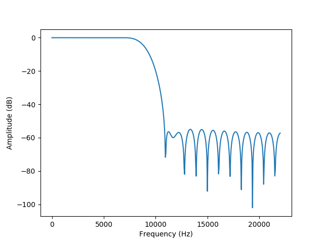

# Lowpass Filter Generation

This code generates the lowpass filter to avoid aliasing for audio downsampled to 16kHz. Therefore the cutoff frequency needs to be slightly larger than 8 kHz. This is because a signal sampled at 16kHz can represent frequencies up to 8kHz uniquely (Nyquist rate) but frequencies above 8kHz will appear as frequencies between 0-8kHz, known as aliasing. Our filter prevents aliasing.

## Quickstart

Generate this filter, or design a new filter:
```
pipenv sync
pipenv run python generate_filter.py
```

This code will print the filter's coefficients and save an image of its frequency response. To update the filter, copy the printed coefficients to `src/Microphone.js`.

## Design

The filter designed is a FIR type 1 with with linear phase*. The filter's cutoff frequency is 9.702kHz for a sampling rate of 44.1kHz. The filter order chosen was 41 (or 41 coefficients) because the transition bandh (magnitude response drop off) was deemed acceptable (by Colin) while being a relatively low number for computational efficiency. The cutoff frqeuency is conservativly high to avoid attenuating energy from 0 to 8 kHz.

The filters frequency response is shown below.



## Implementation Notes
If the input sampling rate is greater than 44.1kHz the cutoff frequency will increase.

If redesigning the filter its cuttoff frequency must be greater than or equal to half of the desired sampling rate.

Ideally, we would have a filter designed for each sampling rate. If we know audio will be input to this code at multiple sampling rates we will need a filter for each sampling rate.

*It's not important if you don't know what this line means.
